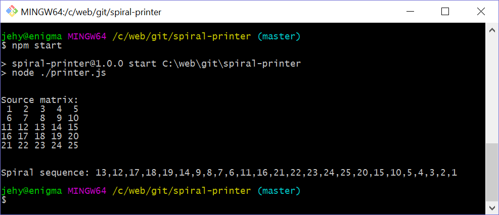

# Spiral Printer

Test task.

## The task

You have matrix `2n-1` x `2n-1`, filled with random values.
You need to output those values in a row, beginning from the center and going in spiral: left, down, right, up and so on.
Solution should work for any value of `n`.

### Example:
 
If you have a matrix:

||||
|:---:|:---:|:---:|
| 1 | 2 | 3 |
| 4 | 5 | 6 |
| 7 | 8 | 9 |
 
Then output should be: `5 4 7 8 9 6 3 2 1`

## Usage

* Set `spiral` in printer.js to your matrix 
* Run `npm start`

## Sample

